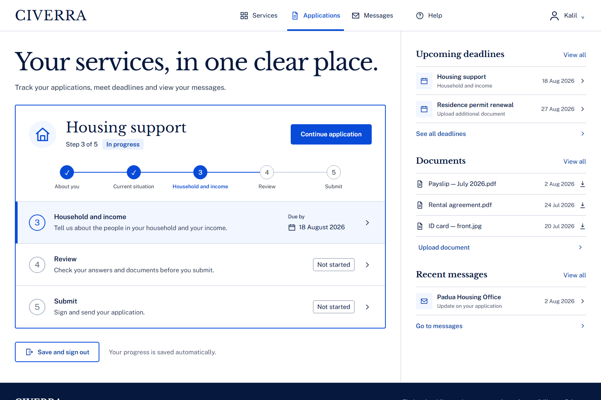

# CIVERRA — Accessible Public-Services Application

[](https://github.com/kalil-tg/civerra-public-services/actions/workflows/quality.yml)


CIVERRA is a working European public-services portal centred on a five-step housing-support application. It demonstrates how complex forms can remain calm, understandable, recoverable, and usable across keyboard and mobile workflows.



## Product outcome

- Responsive account dashboard and five-step application journey
- Explicit current, completed, error, saved, and confirmation states
- Error summary that receives focus and links to invalid fields
- Properly labelled selects, currency input, checkbox, and file input
- Save-for-later live status and final review confirmation
- Mobile disclosure patterns and persistent application actions

## Engineering evidence

- Five Playwright end-to-end tests
- Automated axe-core scans under configured WCAG A/AA tags
- Keyboard focus, error recovery, and mobile-overflow regression checks
- Controlled legacy form preserving reproducible baseline defects
- GitHub Actions workflow for install, lint, build, and browser tests

## Stack

React · TypeScript · Vite · CSS · Playwright · axe-core

## Run locally

```bash
pnpm install
pnpm dev
```

## Verify

```bash
pnpm lint
pnpm build
pnpm test:e2e
```

## Documentation

- [Case study](docs/CASE_STUDY.md)
- [Accessibility audit](docs/ACCESSIBILITY_AUDIT.md)
- [Design system](docs/DESIGN_SYSTEM.md)
- [Fidelity ledger](docs/FIDELITY_LEDGER.md)
- [Manual QA plan](docs/MANUAL_QA_PLAN.md)

## Portfolio

[View the published CIVERRA case study on Contra](https://contra.com/p/QR6L7qge-civerra-accessible-public-services-application-flow)

> CIVERRA is a self-initiated portfolio case study for a fictional public service. It is not paid client work, legal certification, or a claim of complete assistive-technology conformance.
